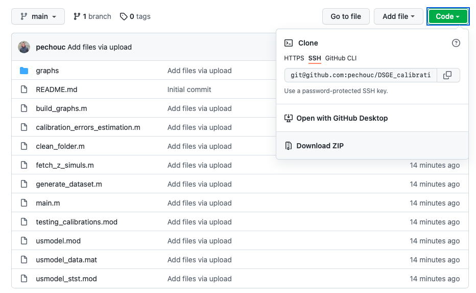

# dbs_empirical_analysis

For my master thesis at Institut Polytechnique de Paris, this repository accompanies [ongoing work](https://github.com/pechouc/destination-based-sales) on the adjustment of aggregated country-by-country report statistics to approximate a destination-based mapping of multinational companies' sales. It contains data files, Python and Stata scripts and command line instructions (for Linux / Mac) that allow to replicate my econometric analysis.

## Replicating the econometric analysis

### Fetching the code and data

To run the code and replicate the econometric analysis, you can first clone this repository with the following command:

```
git clone git@github.com:pechouc/dbs_empirical_analysis.git
```

As an alternative, you can for instance download it as a `.zip` archive as in this picture:



### Collecting the missing data files

Some large data files (the BACI database, CEPII's gravity database and the OECD's country-by-country report statistics) are however missing from the repository. Once you have cloned the repository, if you work under MacOS or Linux, you can run: 

```
cd dbs_empirical_analysis
sh fetch_data.sh
```

Otherwise the links to download the relevant data are in `fetch_data.sh`. 

### Running the estimation

After having loaded the missing data files, you can run the Python and Stata scripts. 

The easiest option is to use the command line instructions that gather the whole protocol:

```
sh protocol.sh
```

The results will be stored directly as LaTeX outputs in the dedicated folder (`latex_outputs`).
